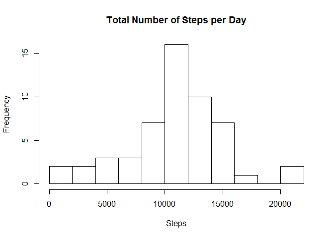
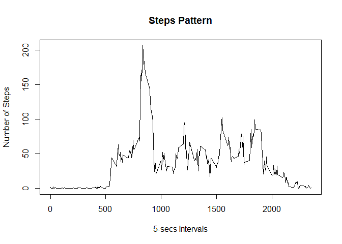
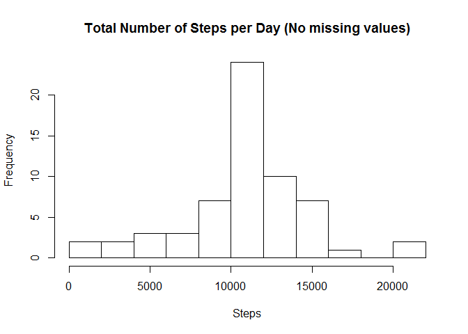
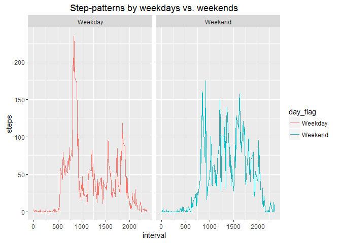

Reproducible Research - Project 1 
=======================================
## Definition of Assignment
It is now possible to collect a large amount of data about personal movement using activity monitoring devices such as a Fitbit, Nike Fuelband, or Jawbone Up. These type of devices are part of the "quantified self" movement - a group of enthusiasts who take measurements about themselves regularly to improve their health, to find patterns in their behavior, or because they are tech geeks. But these data remain under-utilized both because the raw data are hard to obtain and there is a lack of statistical methods and software for processing and interpreting the data.

This assignment makes use of data from a personal activity monitoring device. This device collects data at 5 minute intervals through out the day. The data consists of two months of data from an anonymous individual collected during the months of October and November, 2012 and include the number of steps taken in 5 minute intervals each day.

## Reading and Processing Data

The data is assumed to have been downloaded, unzipped and saved in the current folder under the working folder.

The following steps are performed initially when dealing with the downloaded data:  

### 1. Read the data from the file  

```r
activity <- read.csv("./data/activity.csv")
```
### 2. Processing/Exploring the data:  
- find the class of the variables  

```r
class(activity)
```

```
## [1] "data.frame"
```
- look at the first few lines in the data  

```r
head(activity)
```

```
##   steps       date interval
## 1    NA 2012-10-01        0
## 2    NA 2012-10-01        5
## 3    NA 2012-10-01       10
## 4    NA 2012-10-01       15
## 5    NA 2012-10-01       20
## 6    NA 2012-10-01       25
```
- calcualte a summary of the values  

```r
summary(activity)
```

```
##      steps                date          interval     
##  Min.   :  0.00   2012-10-01:  288   Min.   :   0.0  
##  1st Qu.:  0.00   2012-10-02:  288   1st Qu.: 588.8  
##  Median :  0.00   2012-10-03:  288   Median :1177.5  
##  Mean   : 37.38   2012-10-04:  288   Mean   :1177.5  
##  3rd Qu.: 12.00   2012-10-05:  288   3rd Qu.:1766.2  
##  Max.   :806.00   2012-10-06:  288   Max.   :2355.0  
##  NA's   :2304     (Other)   :15840
```

### Processing Data


## Mean total number of steps taken per day

### 1. The total number of steps taken per day

```r
daily_steps <- with(activity, tapply(steps, date, sum))
```


### 2. Histogram of number of steps taken per day

```r
hist(daily_steps, n=10, xlab="Steps", main = "Total Number of Steps per Day")
```

<!-- -->

### 3. Mean and median of number of steps taken per day

```r
mean_DailySteps <- mean(daily_steps, na.rm = TRUE)
median_DailySteps <- median(daily_steps, na.rm = TRUE)
```

The mean and the median of the number of steps per day are 1.0766189\times 10^{4} and 10765, respectively.


## The average daily activity pattern

### 1. Time series plot of pattern 

```r
pattern_steps <- with(activity, tapply(steps, interval, mean, na.rm = TRUE)) # average of steps per interval
int5 <- with(activity, tapply(interval, interval, mean, na.rm = TRUE)) # vector with intervals
plot(int5,pattern_steps, type = "l", xlab="5-secs Intervals", ylab="Number of Steps", main = "Steps Pattern")
```

<!-- -->

### 2. Interval with maximum number of steps 


```r
max_value <- max(pattern_steps)
max_interval <- int5[pattern_steps == max_value]
```

The maximum number of steps in a 5-secs interval is 206.1698113 and was recorded in interval 835.

## Inputing missing values

### 1. Total umber of missing values

```r
Total_Missing <- sum(is.na(activity$steps))
```
The total number of missing values is 2304.

### 2. Strategy for missing values
I will replace the missing value in an interval by the mean value of that respective 5-minute interval accross all recorded days. 

### 3. Create new dataset

A new dataset is created with all missing values filled out using the startegy above.


```r
activity_full <- activity
check_na <- is.na(activity$steps)
for (i in seq(1, length(check_na), by = 1)){
      if (check_na[i] == TRUE){
            activity_full$steps[i] <- pattern_steps[activity$interval[i] == int5]            
      }
}
```

### 4. Processing data of the full new dataset
Hitogram of the total number of steps taken each day for the new dataset is shown.


```r
daily_steps_full <- with(activity_full, tapply(steps, date, sum))
hist(daily_steps_full, n = 10, xlab="Steps", main = "Total Number of Steps per Day (No missing values)")
```

<!-- -->

```r
mean_DailySteps_full <- mean(daily_steps_full, na.rm = TRUE)
median_DailySteps_full <- median(daily_steps_full, na.rm = TRUE)
```

The mean and the median of the number of steps per day are 1.0766189\times 10^{4} and 1.0766189\times 10^{4}, respectively. The impact is minimal on the mean and the median since mean values of 5-sec intervals were used to fill out missing values. However, the distribution is changed, bringing more probability mass around the mean, as expected.


## Weekday-weekend activity patterns
### 1. Add factor variable to dataset

```r
day <- weekdays(as.POSIXlt(activity$date), abbreviate = TRUE)
wkday <- factor((day=="Sun" | day == "Sat"), labels = c("Weekday", "Weekend")) # new factor variable
activity["day_flag"] <- wkday # insert the new variable to dataframe
```

### 2. Plot weekend-weekday step patterns
Created plots to compare step-patterns between weekdays and weekends.

```r
pattern_steps <- as.data.frame(with(activity, tapply(steps, list(interval, wkday), mean, na.rm = TRUE)))

steps <- c(pattern_steps[,1], pattern_steps[,2])
day_flag <- c(rep("Weekday", times = length(steps)/2), rep("Weekend", times = length(steps)/2))
interval <- c(int5,int5)
pattern_steps_new <- data.frame(interval,steps,day_flag)

library(ggplot2)
qplot(interval, steps, data = pattern_steps_new, facets = .~day_flag, color = day_flag, geom = "line")+ ggtitle("Step-patterns by weekdays vs. weekends")
```

<!-- -->

